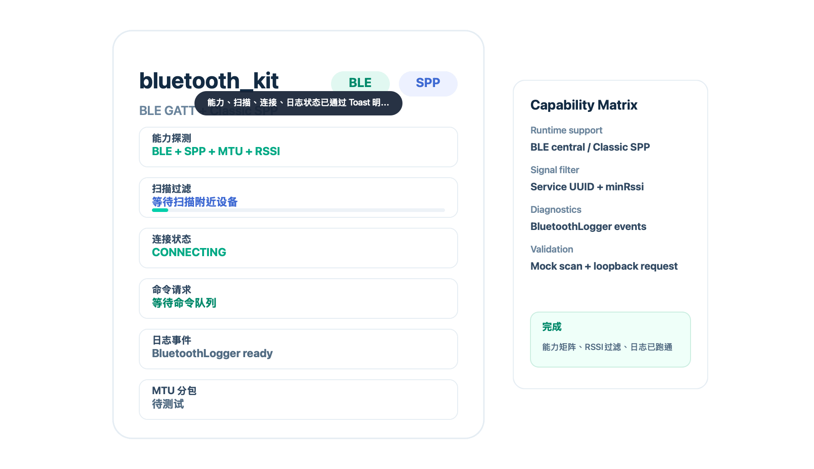

# bluetooth_kit

`bluetooth_kit` 是一个面向 OpenHarmony/HarmonyOS ArkTS 的蓝牙连接与协议配置工具包，适合智能家居、IoT 设备、工控外设、仪表设备等场景。它把业务协议、设备画像、扫描/连接传输适配器拆开，方便同一套业务代码同时接 BLE GATT、传统蓝牙 SPP，以及用户自定义的私有协议。

## 设计目标

- 同时建模 BLE GATT 与传统蓝牙 SPP，业务层不直接依赖系统蓝牙 API。
- 用 `BluetoothDeviceProfile` 描述设备画像：连接方式、BLE Service/Characteristic、SPP UUID、协议、重连策略。
- 用 `BluetoothProtocolCodec` 承接不同业务协议，默认提供长度前缀二进制协议与文本行协议。
- 提供 profile 校验、扫描抽象、半包/粘包解析、CRC、序号、ACK/DATA 应答匹配、超时重试、MTU 分包等蓝牙链路常见能力。
- 允许业务方注入自定义 `TransportFactory`、`ScannerFactory` 与 `CustomProtocolFactory`。

## 鸿蒙侧要求

根据 HarmonyOS GATT 开发文档，BLE GATT 可用于连接服务端、读写 Characteristic/Descriptor、订阅通知/指示、读取 RSSI、设置 MTU；相关 API 位于 Connectivity Kit 的蓝牙 BLE/GATT 能力。BLE 广播与扫描能力使用 `@kit.ConnectivityKit` 中的 `ble` API，例如 `startBLEScan`、`stopBLEScan` 和 `BLEDeviceFind` 事件。传统蓝牙串口协议对应 SPP/socket 能力。

应用侧需要按目标 SDK 和实际 API 版本声明并申请蓝牙权限。HarmonyOS NEXT 文档重点要求 `ohos.permission.ACCESS_BLUETOOTH`；旧版 OpenHarmony/HarmonyOS 兼容场景还需要评估 `USE_BLUETOOTH`、`DISCOVER_BLUETOOTH` 等权限差异。后台蓝牙扫描/交互需要按长时任务能力单独设计，不能默认承诺后台常连。

真实扫描、配对、连接、MTU 协商、后台行为和厂商设备协议都必须真机验证。本包当前版本提供稳定的可复用协议层与传输适配器边界，demo 使用内存扫描器和回环传输验证配置、编解码、命令队列和页面集成。

`module.json5` 权限声明可参考：

```json5
{
  "module": {
    "requestPermissions": [
      { "name": "ohos.permission.ACCESS_BLUETOOTH" }
    ]
  }
}
```

## 基础用法

```ts
import {
  BluetoothBearer,
  BluetoothConnectionManager,
  BluetoothScanMode,
  BluetoothWriteMode,
  JsonLineCodec,
  LengthPrefixedCodec,
  MemoryBluetoothScanner,
  MemoryLoopbackTransport
} from 'bluetooth_kit'

const bleServiceUuid = '0000fff0-0000-1000-8000-00805f9b34fb'

const manager = new BluetoothConnectionManager({
  profiles: [
    {
      profileId: 'smart-lock-ble',
      displayName: 'Smart Lock BLE',
      bearer: BluetoothBearer.BleGatt,
      protocolId: 'length-prefixed-v1',
      ble: {
        serviceUuid: bleServiceUuid,
        writeCharacteristicUuid: '0000fff1-0000-1000-8000-00805f9b34fb',
        notifyCharacteristicUuid: '0000fff2-0000-1000-8000-00805f9b34fb',
        descriptorUuid: '00002902-0000-1000-8000-00805f9b34fb',
        mtu: 185,
        writeMode: BluetoothWriteMode.WithResponse
      },
      policy: {
        connectTimeoutMs: 10000,
        commandTimeoutMs: 3000,
        retryCount: 2,
        retryBackoffMs: 300,
        reconnectKnownDevice: true
      }
    },
    {
      profileId: 'serial-classic',
      displayName: 'Serial Classic Device',
      bearer: BluetoothBearer.ClassicSpp,
      protocolId: 'json-line-v1',
      classic: {
        serviceUuid: '00001101-0000-1000-8000-00805f9b34fb',
        secure: true
      },
      policy: {
        connectTimeoutMs: 12000,
        commandTimeoutMs: 4000,
        retryCount: 1,
        retryBackoffMs: 500,
        reconnectKnownDevice: false
      }
    }
  ],
  codecs: [new LengthPrefixedCodec(), new JsonLineCodec()],
  transportFactory: {
    create() {
      return new MemoryLoopbackTransport()
    }
  },
  scannerFactory: {
    create() {
      return new MemoryBluetoothScanner([{
        deviceId: 'memory-loopback-001',
        name: 'Memory Lock BLE',
        serviceUuids: [bleServiceUuid],
        connectable: true
      }])
    }
  }
})

const profileErrors = manager.validate()
if (profileErrors.length > 0) {
  console.error(profileErrors[0].message)
}

await manager.scan({
  mode: BluetoothScanMode.Ble,
  timeoutMs: 1500,
  filters: [{ serviceUuid: bleServiceUuid }]
}, (device) => {
  console.info('found device=' + device.deviceId)
})

manager.onPacket((packet) => {
  console.info('packet command=' + packet.command.toString())
})

await manager.connect({
  deviceId: 'memory-loopback-001',
  name: 'Memory Lock BLE'
}, 'smart-lock-ble')

const result = await manager.request({
  command: 0x10,
  payload: new ArrayBuffer(0),
  expectAck: true
})
console.info('attempts=' + result.attempts.toString() + ', timeout=' + result.timedOut.toString())
```

## 自定义协议

实现 `BluetoothProtocolCodec` 即可接入私有协议。协议对象只负责 `BluetoothPacket` 与 `ArrayBuffer` 之间的转换，半包缓存、请求序号、超时重试由连接管理器处理。

```ts
class VendorCodec implements BluetoothProtocolCodec {
  readonly protocolId: string = 'vendor-v1'

  encode(packet: BluetoothPacket): ArrayBuffer {
    return packet.payload
  }

  decode(buffer: ArrayBuffer): DecodeResult {
    return {
      packets: [],
      rest: buffer
    }
  }
}
```

如果协议 ID 需要运行时决定，可以通过 `customProtocolFactory` 延迟创建：

```ts
customProtocolFactory: {
  create(protocolId: string): BluetoothProtocolCodec | undefined {
    return protocolId === 'vendor-v1' ? new VendorCodec() : undefined
  }
}
```

## 接真实 HarmonyOS 蓝牙

生产项目中需要把系统蓝牙 API 包装成 `BluetoothScanner` 与 `BluetoothTransport`：

- `BleGattScanner`：封装 `startBLEScan`、`stopBLEScan`、`BLEDeviceFind`，把扫描结果转换为 `BluetoothDeviceSnapshot`。
- `BleGattTransport`：封装 GATT 连接、服务发现、通知订阅、Characteristic 写入、MTU 设置与断连状态。
- `ClassicSppTransport`：封装传统蓝牙配对、SPP socket 连接、读写循环与异常关闭。
- `PermissionHelper`：在应用模块中声明并申请 `ohos.permission.ACCESS_BLUETOOTH`，旧设备按版本兼容旧权限。

## Demo 验证



仓库中的 `example/BluetoothKitDemo.ets` 可直接拷到 HarmonyOS entry 页面中运行。示例使用 `MemoryBluetoothScanner` 和 `MemoryLoopbackTransport`，并提供页面内 Toast/Dialog，让用户能明显感知扫描、连接、收包、完成和异常状态。它可验证：

- BLE profile 与 Classic SPP profile 可同时配置。
- `LengthPrefixedCodec` 与 `JsonLineCodec` 可同时注册。
- `BluetoothConnectionManager.validate()` 能检查配置。
- `scan()` 能按 Service UUID/name 过滤设备。
- `request()` 能走命令队列，匹配同序号响应。
- `BleMtuChunker` 能按 MTU 生成分包。

## 下一步开发

- `BleGattTransport`：封装扫描、`createGattClientDevice`、连接状态、服务发现、通知订阅、读写、MTU 设置。
- `ClassicSppTransport`：封装传统蓝牙配对、SPP socket 连接、读写循环。
- 真机 example：接入实际 BLE 外设，录制扫描、连接、收发、断连恢复流程。
